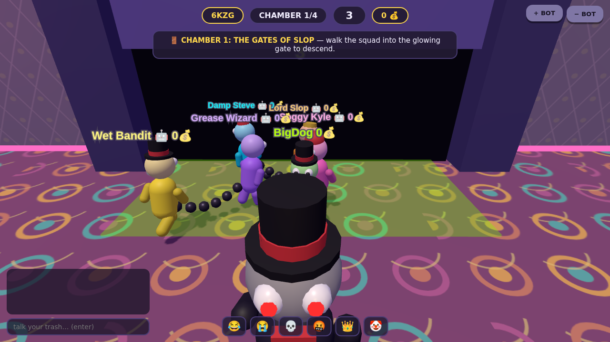
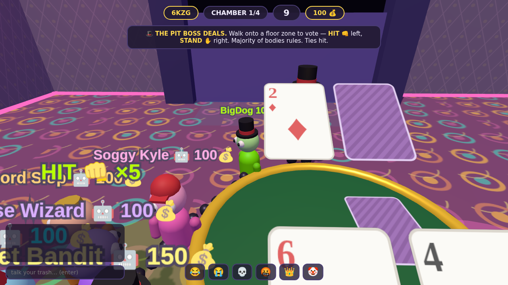
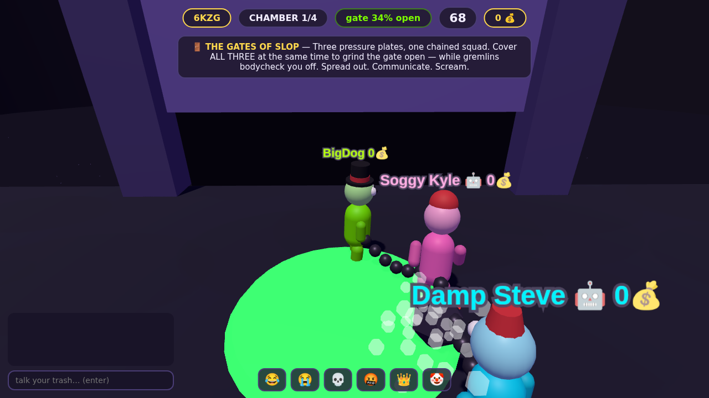
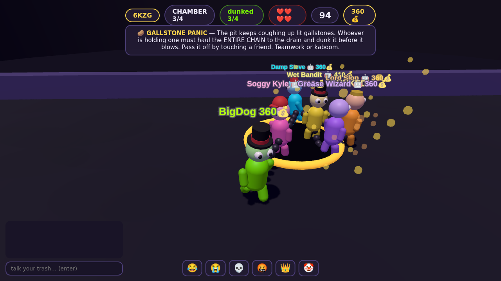

# 🫠 FRIENDSLOP

> chained to the boys. one way out of the pit. don't bust.

A 2–8 player **3D co-op party game**. You and the boys are little slop-people
(chunky humanoids in dumb hats), **physically chained together**, trying to
escape a living dungeon called the Slop Pit. Between chambers you hang out in **The Den** — a walkable casino-carpet
hub where everything is embodied: walk the squad into the glowing gate to start
the next chamber, and settle your fate at the Pit Boss's blackjack table by
literally **standing on the HIT or STAND floor zone**. Majority of bodies rules.
Ties hit. Losing the hand means running the chamber back.

| | |
|---|---|
|  |  |
|  |  |

## The expedition

Four original chambers, in order, with **shared team lives**. Clear all four and
the boys escape. Each clear pays every blob 💰 (plus MVP and unused-life
bonuses) — most money at the end gets bragging rights, but escape is the win.

1. 🚪 **THE GATES OF SLOP** — stretch the chain across all pressure plates *at
   the same time* to grind the gate open, while gremlins bodycheck you off.
2. 🌊 **THE BELCHING GUT** — when the stomach rumbles, drag the whole chain onto
   a safe island before the acid wave. The islands shrink. The chain does not.
3. 🥔 **GALLSTONE PANIC** — the pit coughs up lit explosives. Whoever's holding
   one hauls the entire chain to the drain before it blows.
4. 🕳️ **THE GREAT ESCAPE** — the crust crumbles under every step. Get EVERY
   SINGLE BLOB to the exit ledge. Nobody gets left behind.

After each clear (except the last — clearing the final chamber IS the escape),
the Pit Boss deals one hand of blackjack to the whole squad. Win → the gate
opens. Lose → run it back. The vote is a shouting match with legs.

## Play it right now

```bash
npm install
npm start          # → http://localhost:3000
```

One person **HOSTS**, sends the 4-letter room code to the boys, everyone else
**JOINS** — you all drop straight into the Den. Short on friends? The host can
add **bots**: they walk to the gate, play every chamber, and vote at the table
with their own bodies (they will absolutely drag you into the pit early).

**Controls:** click the world to mouse-look · WASD to walk (camera-relative) ·
SPACE/SHIFT to dash · Q/E to turn without a mouse · 1–6 emotes · ENTER chat

To play over the internet, run the server on any $5 VPS / Fly.io / Railway box
and share the URL — it's a single Node process.

## What's in the box

```
server/            authoritative game server (Node + ws, 30Hz sim, 20Hz snapshots)
  room.js          the Den + expedition state machine (gate walks, body votes)
  blackjack.js     the Pit Boss's deck (pure logic, unit-tested)
  gremlins.js      chainless AI shovers
  minigames/       one file per chamber — same interface, easy to add more
  bots.js          squad AI: chambers, hub walking, blackjack instincts
client/            Three.js 3D client — no build step, no assets, all procedural
  js/render.js     the world: Den, chambers, chain, cards, particles, camera
  js/sfx.js        WebAudio-synthesized sound (zero audio files)
shared/            constants shared by both sides (incl. hub zone layout)
electron/          desktop shell for the Steam build
docs/GAME_DESIGN.md  design doc · docs/STEAM.md  step-by-step Steam shipping guide
test/              full-expedition integration test + Chromium smoke test
```

## Tests

```bash
npm test
```

- `test/logic.mjs` — unit-tests the blackjack engine (3000 hands), then plays a
  full expedition over real WebSockets: clients *steer their blobs* into the
  gate and vote zones, clear chambers, resolve hands, reach the podium, and
  handle disconnects.
- `test/smoke-browser.mjs` — real Chromium pages host/join via the UI and walk
  the entire expedition on autopilot; fails on any console error.

`FRIENDSLOP_FAST=1` shrinks every timer so a full expedition runs in ~30s.

## Steam

See **[docs/STEAM.md](docs/STEAM.md)** — Electron packaging, Steamworks setup,
achievements, depot upload, launch checklist.
