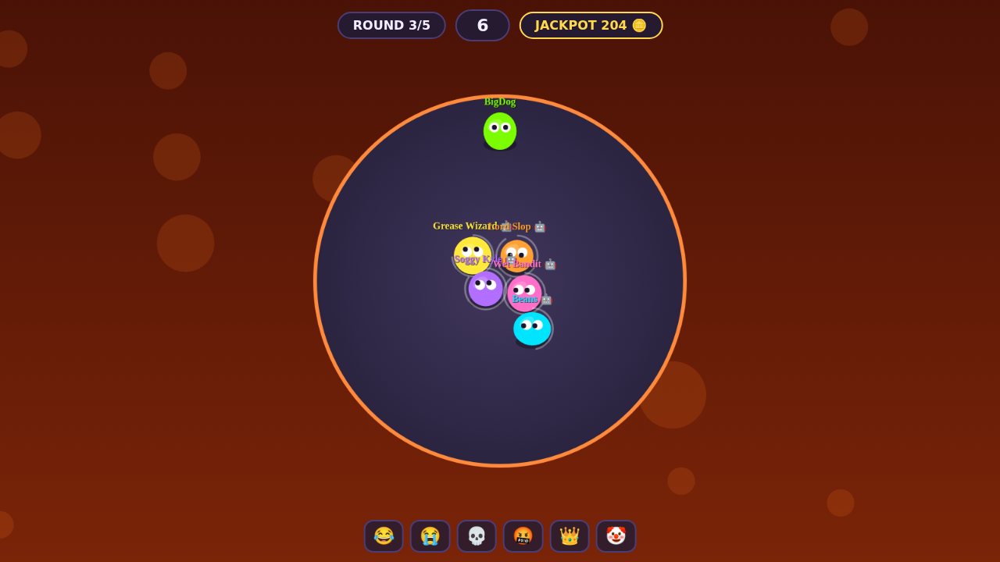
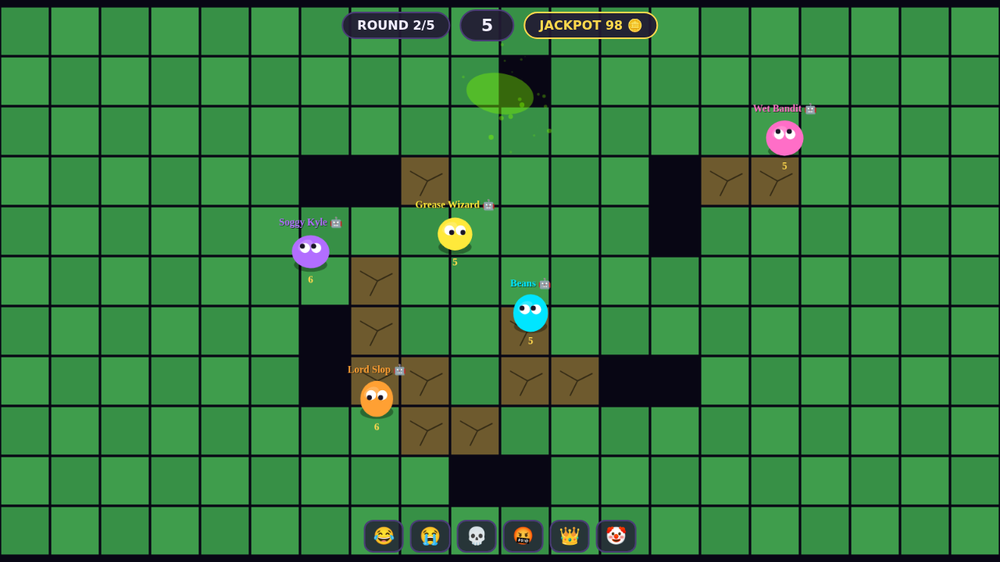
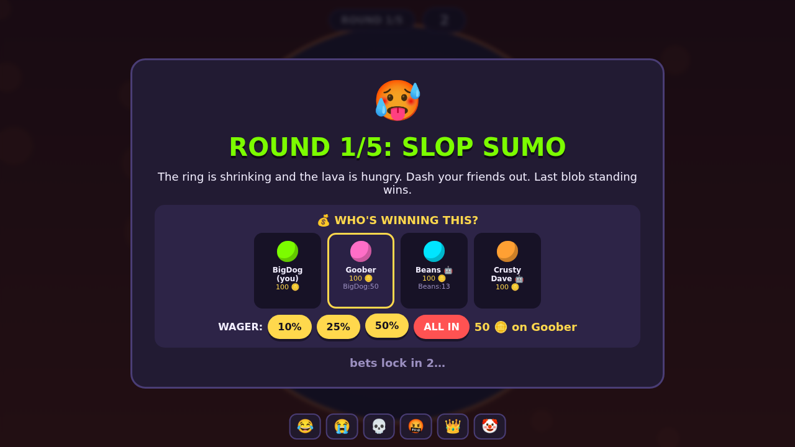
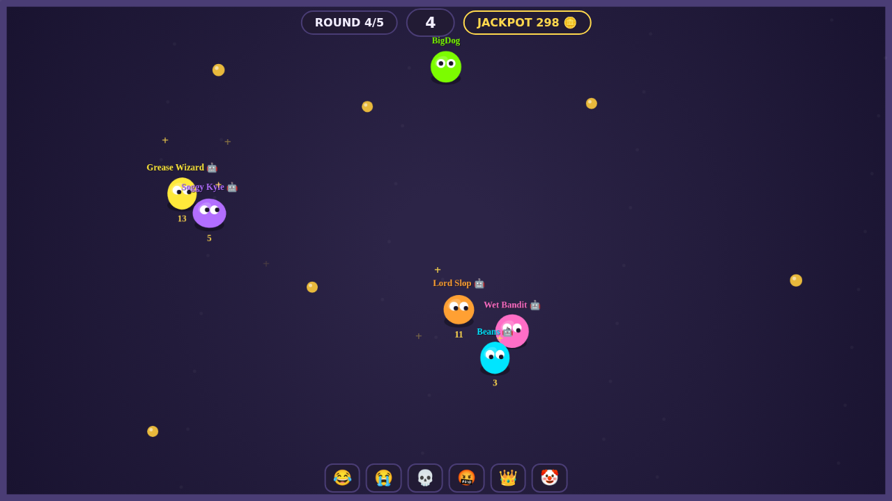

# 🫠 FRIENDSLOP

> bet on your friends. betray your friends. become the slop.

A 2–8 player online party game. You're all blobs of slop. Each round the game deals
a chaotic physics minigame — **Slop Sumo, Hot Tater, Greed Pit, The Floor Is Slop** —
and before it starts, everyone *publicly* bets Slop Coins on who's going to win.
Correct bettors split the pot; if nobody calls it, the pot rolls into a growing
jackpot. Richest blob after 5 rounds wins. Friendships may not survive.

| | |
|---|---|
|  |  |
|  |  |

## Play it right now

```bash
npm install
npm start          # → http://localhost:3000
```

One person clicks **HOST A GAME** and sends the 4-letter room code to the boys;
everyone else hits **JOIN**. Short a player? The host can **ADD BOT** — the bots
gamble too, and they will absolutely take your money.

**Controls:** WASD/arrows to move · Space/Shift to dash · 1–6 to emote

To play over the internet, run the server anywhere public (any $5 VPS, Fly.io,
Railway — it's a single Node process) and share the URL.

## What's in the box

```
server/            authoritative game server (Node + ws, 30Hz sim, 20Hz snapshots)
  minigames/       one file per minigame — add your own, the round queue picks it up
  bots.js          lobby-filler AI that plays every minigame and places bets
client/            zero-dependency canvas client (rendering, WebAudio SFX, UI)
shared/            constants shared by both sides
electron/          desktop shell for the Steam build
docs/GAME_DESIGN.md  full design doc (economy, minigames, pillars)
docs/STEAM.md        step-by-step guide to shipping this on Steam
test/              full-match integration test + browser smoke test
```

## Tests

```bash
npm test
```

- `test/logic.mjs` — spins up a real server and plays an entire 5-round match with
  3 WebSocket clients + a bot: betting, clamping, pot splits, jackpot, podium,
  disconnects.
- `test/smoke-browser.mjs` — drives real Chromium through hosting, joining, chatting,
  betting, and a full match; fails on any console error; drops screenshots in
  `test/screenshots/`.

`FRIENDSLOP_FAST=1` shortens all timers so a full match runs in ~40 seconds.

## Steam

See **[docs/STEAM.md](docs/STEAM.md)** — Electron packaging, Steamworks setup,
achievements, depot upload, launch checklist.
