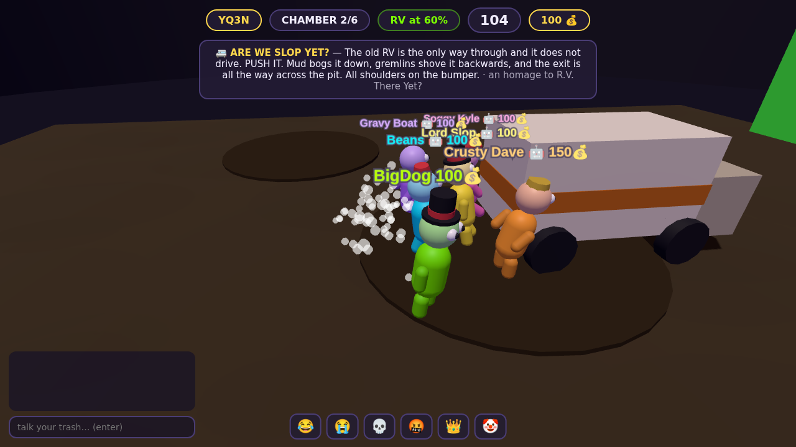
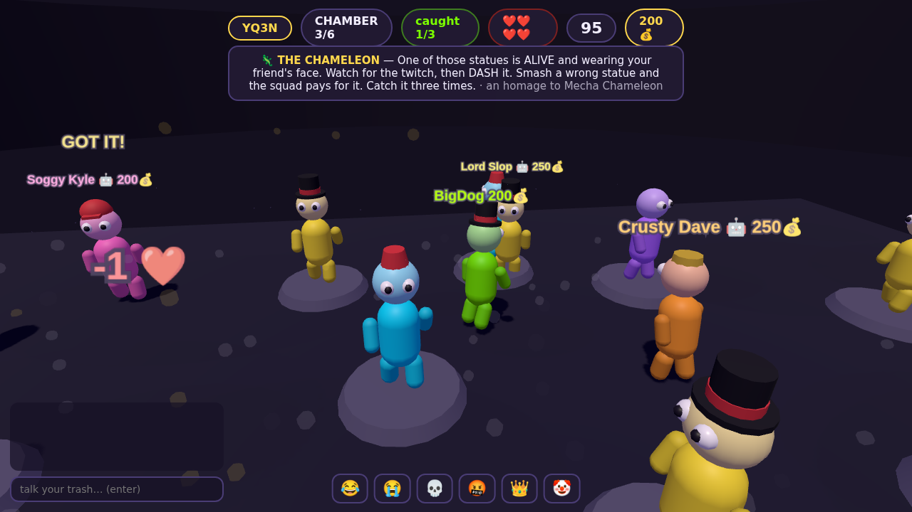
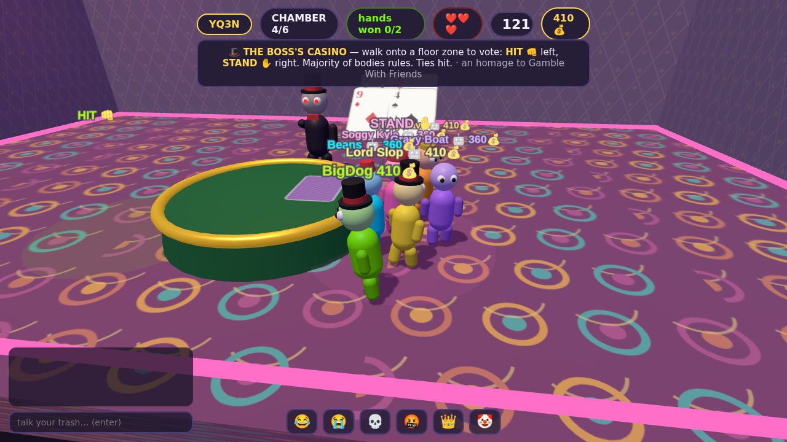
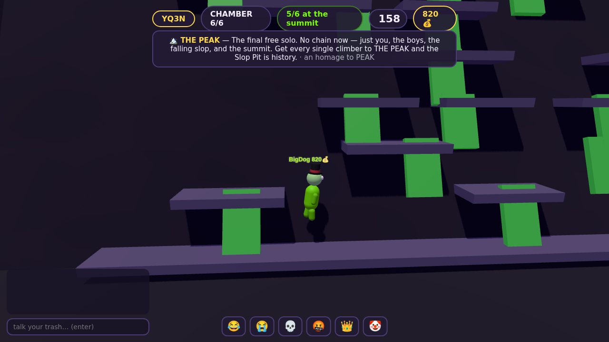

# 🫠 FRIENDSLOP

> six levels down. every one a classic. don't bust.

A 2–8 player **3D co-op party game**. You and the boys are little slop-people
(chunky ragdolly humanoids in dumb hats) escaping a living dungeon called the
Slop Pit — **six chambers, each one an homage to a friendslop classic**.
Between chambers you hang out in **The Den**, a walkable casino-carpet hub:
no menus, no buttons — walk the squad into the glowing gate to start the next
level.

| | |
|---|---|
|  |  |
|  |  |

## The expedition

Six chambers, in order, all co-op. Clear one and the gate to the next opens.
Clear all six and the boys escape. Fail and you run it back — the pit collapses
after 20 attempts, so every retry counts.

1. ⛏️ **THE DIG SITE** — *an homage to Keep Digging.* Dash the ground to crack
   it, drop through, repeat. Everyone must reach the bottom, three floors down.
2. 🚐 **ARE WE SLOP YET?** — *R.V. There Yet?* The RV doesn't drive. PUSH IT
   across the pit — through mud, past gremlins shoving it backwards.
3. 🦎 **THE CHAMELEON** — *Mecha Chameleon.* One statue is alive and wearing a
   friend's face. Watch for the twitch, dash the real one. Wrong smashes cost
   shared lives. Three catches to clear.
4. 🎩 **THE BOSS'S CASINO** — *Gamble With Friends.* The Pit Boss deals
   blackjack to the whole squad. Vote with your BODY — stand in the HIT or
   STAND floor zone. Majority rules, ties hit. Win 2 hands before busting out.
5. ⛓️ **CHAINED TOGETHER** — *Chained Together.* The pit chains the squad for
   this climb, and the slop tide is rising. Ledges hold, vines climb, one slip
   drags everyone. The only chained level — by design.
6. 🏔️ **THE PEAK** — *PEAK.* The finale free solo: no chain, a full-height
   wall, falling slop. Every climber to the summit and the Slop Pit is history.

Money flows on every clear (+MVP and unused-life bonuses) — richest slop at
the end gets bragging rights, but escape is the win.

## Play it right now

```bash
npm install
npm start          # → http://localhost:3000
```

One person **HOSTS**, sends the 4-letter room code to the boys, everyone else
**JOINS** — you all drop straight into the Den. Short on friends? The host can
add **bots**: they dig, push, pounce, climb single-file, and vote at the
casino with their own bodies.

**Controls:** click the world to mouse-look · WASD to walk (camera-relative) ·
SPACE/SHIFT to dash · 1–6 emotes (they play on your body — try 💀) · ENTER chat

To play over the internet, run the server on any $5 VPS / Fly.io / Railway box
and share the URL — it's a single Node process.

## What's in the box

```
server/            authoritative game server (Node + ws, 30Hz sim, 20Hz snapshots)
  room.js          the Den + expedition state machine
  blackjack.js     the Boss's deck (pure logic, unit-tested)
  minigames/       one file per chamber — same interface, easy to add more
  bots.js          squad AI for every chamber + hub life
client/            Three.js 3D client — no build step, no assets, all procedural
  js/render.js     the world: Den, six chambers, ragdoll characters, cards
  js/sfx.js        WebAudio-synthesized sound (zero audio files)
shared/            constants shared by both sides
electron/          desktop shell for the Steam build
docs/GAME_DESIGN.md  design doc · docs/STEAM.md  step-by-step Steam shipping guide
test/              full-expedition integration test + Chromium smoke test
```

## Tests

```bash
npm test
```

- `test/logic.mjs` — unit-tests the blackjack engine (3000 hands), then plays a
  full expedition over real WebSockets: walks blobs into gates, digs, pushes,
  body-votes at the casino, climbs, reaches the podium, handles disconnects.
- `test/smoke-browser.mjs` — real Chromium pages host/join via the UI and walk
  the entire expedition on autopilot; fails on any console error.

`FRIENDSLOP_FAST=1` shrinks every timer so a full expedition runs in ~30s.

## Steam

See **[docs/STEAM.md](docs/STEAM.md)** — Electron packaging, Steamworks setup,
achievements, depot upload, launch checklist.
