# NO MONEY DOWN

> You and the boys bought a $250,000 motorhome with no money down.
> Payments are due every night. None of you have jobs.

A 1–6 player **first-person co-op road trip**, built for proximity voice and
bad decisions. Drive the Slopmaster 9000 across five days of procedurally
generated road (green meadows, golden farmland, a snowbound pass, red canyon
country, open desert), scavenge fragile junk, climb, winch, shove, gamble the
shared bank account, and pay the Repo Man by midnight, or he takes the doors.
Then the roof. Then the RV.

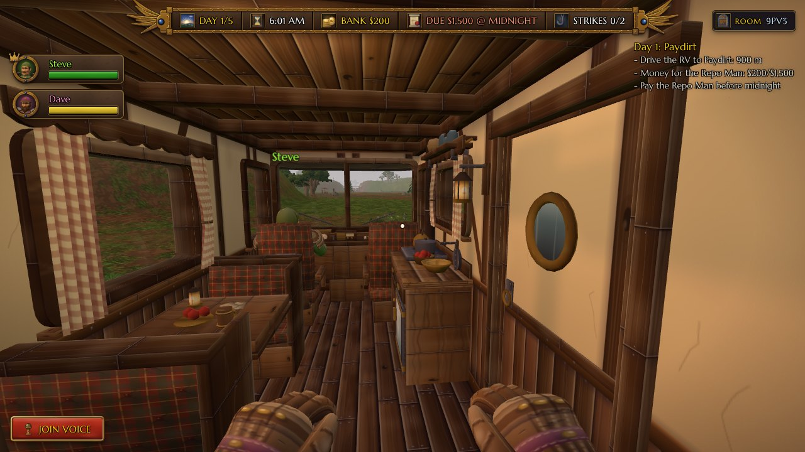

| | |
|---|---|
| 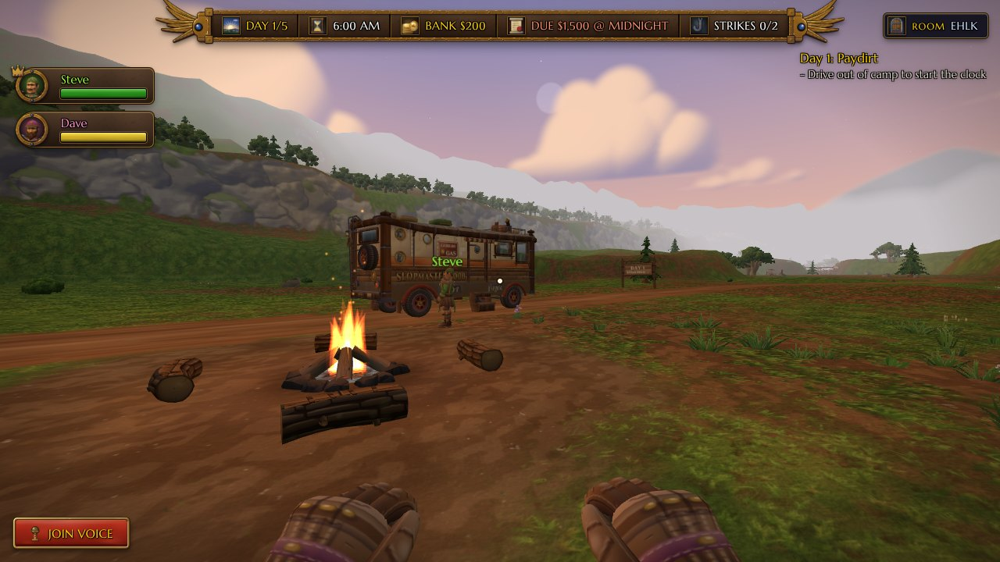 | 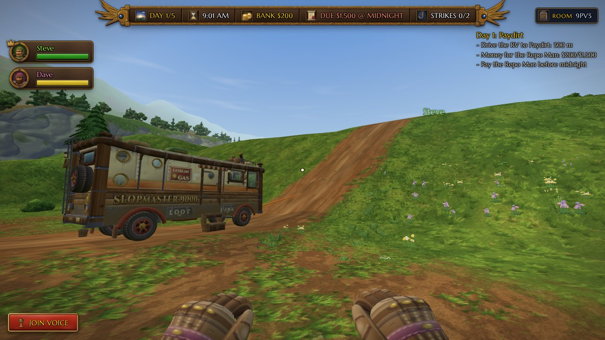 |
| **Morning camp.** The clock doesn't start until the RV rolls out. | **The Grade.** Too steep to drive. Somebody climbs up with the winch hook. |
| 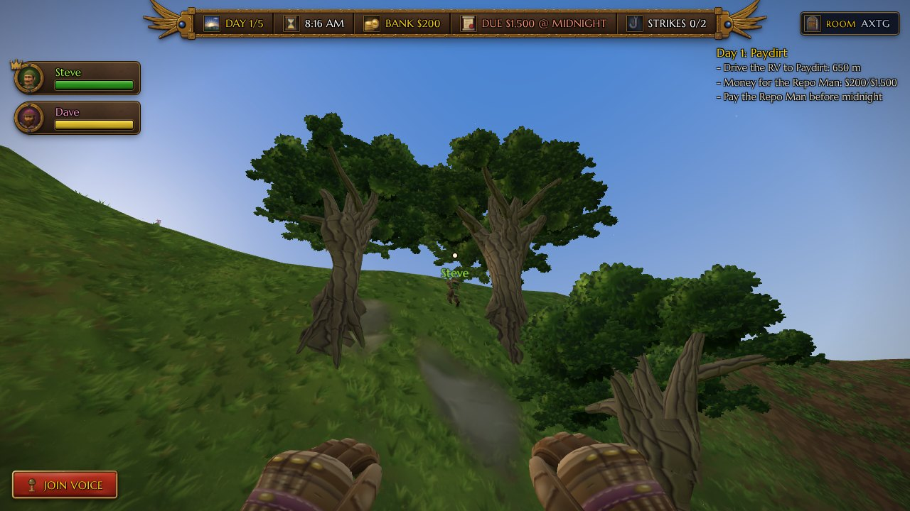 | 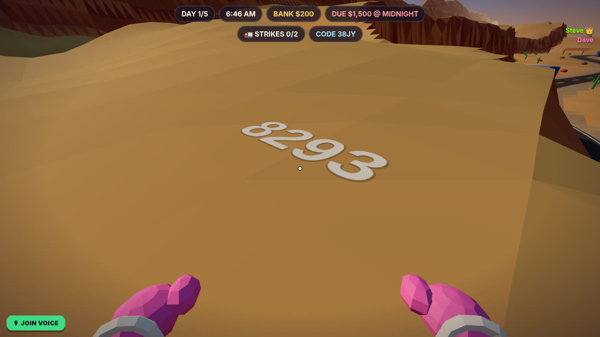 |
| **Climb anything steep**, on a stamina bar (PEAK rules). | **The ranger gate code** is painted up on the rim. Shout it down. |
| 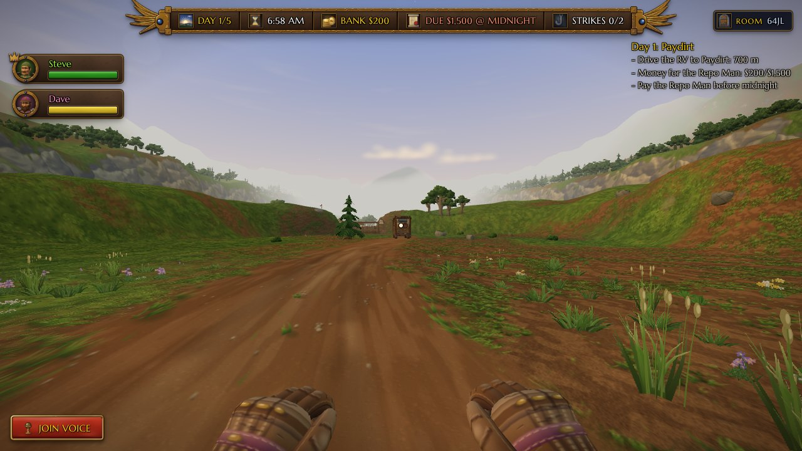 | 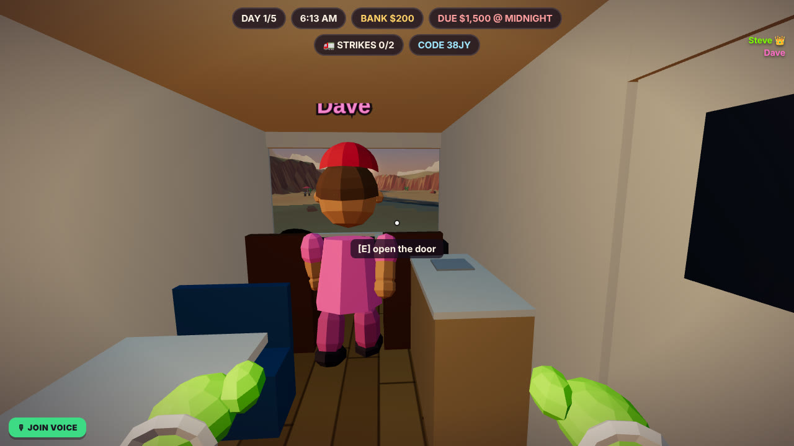 |
| **Fragile physics loot.** Every bump costs money. | **One paper map.** Only whoever's holding it can read it. |
| 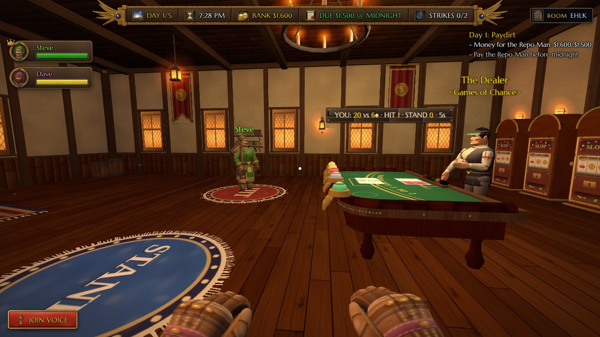 | 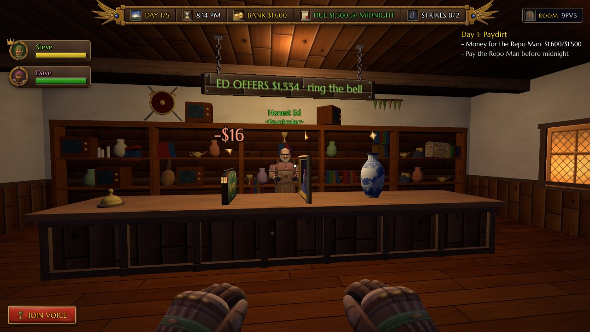 |
| **The Lucky Slop.** Bet the *shared* bank, vote HIT/STAND with your body. | **Honest Ed's Pawn.** Put it on the counter, ring the bell. |
| 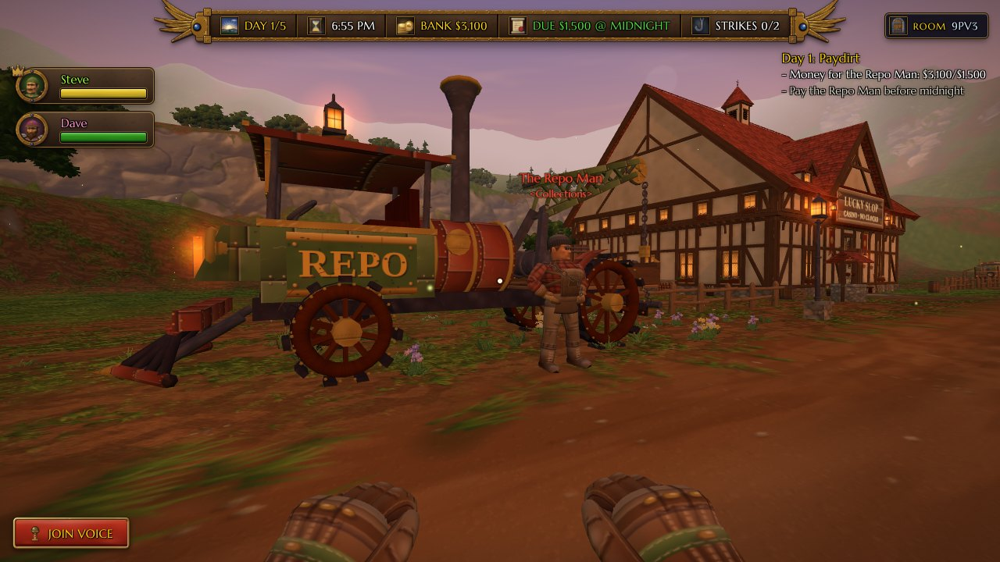 | 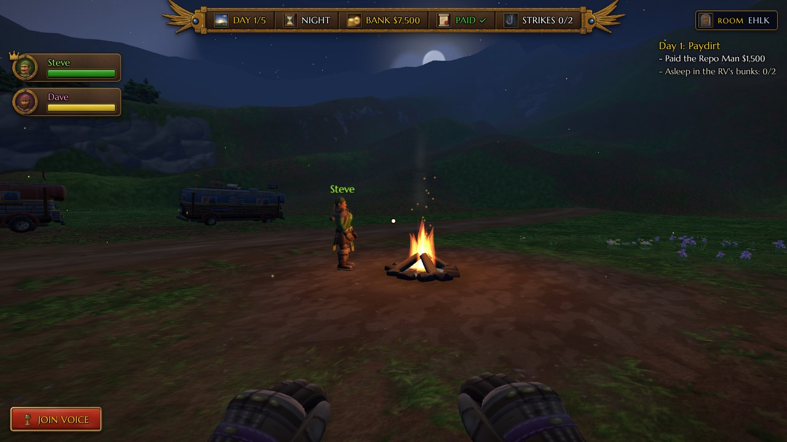 |
| **The Repo Man** collects at midnight. | **Night.** Receipt, campfire, store, bunks, day 2. |

## Five days, five places

Every day is a different biome with its own ground, sky, fog, rocks, plants
and town. You never see the same place twice in a run.

| Day | Road | Looks like | Town |
|---|---|---|---|
| 1 | The Westmeadow Road | Green meadows, huge gnarled oaks in groves, gray outcrops | **Paydirt**: timber-framed plaster, red shingle roofs |
| 2 | Goldenfield Pike | Golden grass, haybales, rail fences, a windmill | **Busted Flats**: plank barns and farmsteads |
| 3 | Frostpeak Pass | Snowfields, snow-laden pines, blue-gray granite | **Last Chance**: squat stone halls, iron braziers |
| 4 | The Redrock Badlands | Red strata, hoodoos, buttes, dead trees | **Snake Eyes**: log and plank outpost, palisades, hides |
| 5 | The Lost Wages Flats | Dunes, sandstone arches, palms, bleached bones | **Lost Wages**: adobe, vigas, canvas awnings, goblin brass |

| | |
|---|---|
| 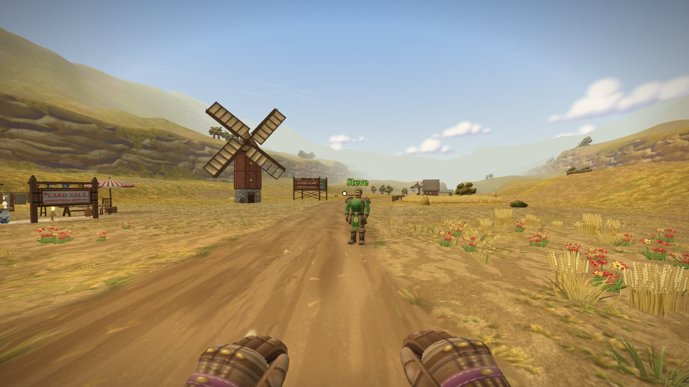 | 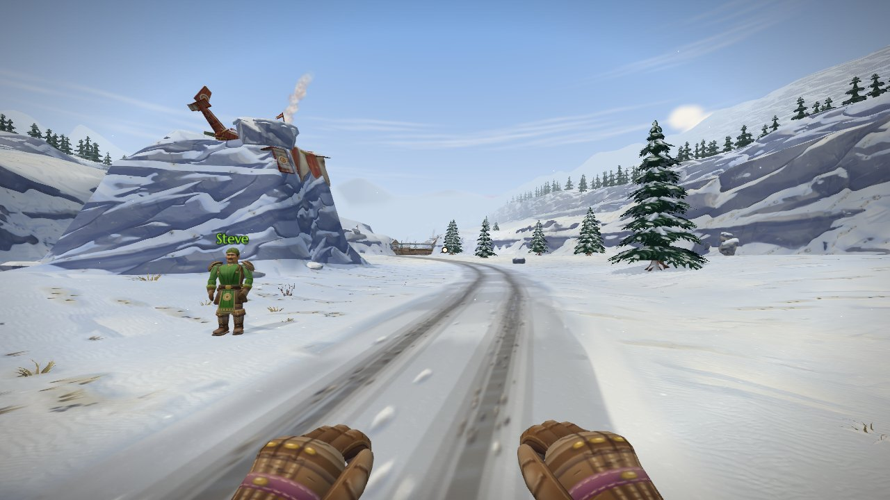 |
| 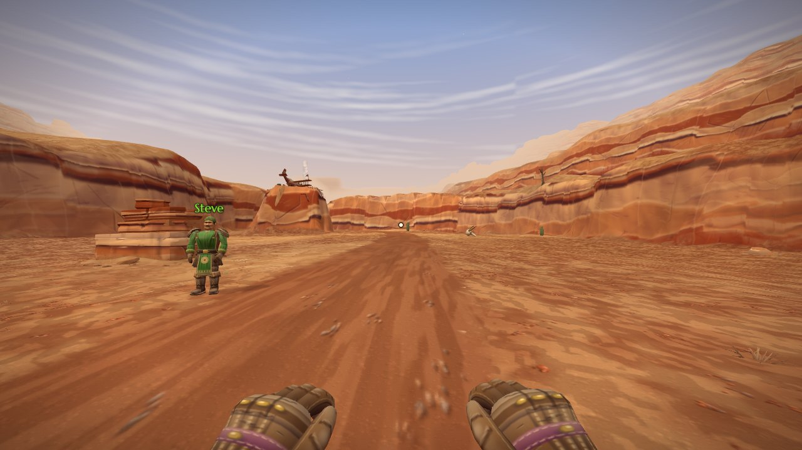 | 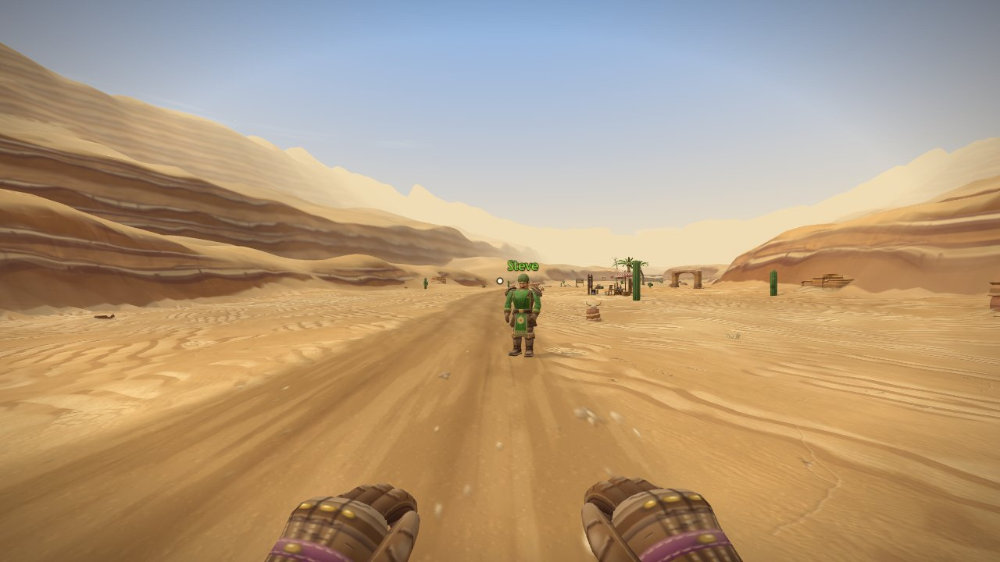 |

**The look** is a 2004 hand-painted MMO zone: chunky low-poly models with
smooth shading under painted textures with the light baked in, warm and
slightly hazy. No image files ship with the game. Every texture (grass,
shingles, bark, faces, the pawn shop's sign) is painted on a canvas by code
when the game loads. Layers of blotches, strokes, lit edges and soft
shadows are built up the way a texture artist would paint them. The rules
are in **[docs/ART.md](docs/ART.md)**.

## Why this game, and not the last one

This repo's first attempt (THE SLOP PIT) was six two-minute homage minigames
on a 2D plane with one verb (dash). It wasn't fun, and **[docs/DESIGN.md](docs/DESIGN.md)**
explains why and what replaced it. The short version: every friendslop hit is
*one deep physics verb + proximity voice + shared stakes under a clock*, so
this game has one spine (the RV road trip) and steals one verb from each
classic:

| From | We took |
|---|---|
| **PEAK** | Climb any steep surface on stamina. Carried weight shrinks your bar. Lunge for holds. Knockouts, friends picking you up, campfire nights. |
| **R.V. There Yet?** | A shared physics vehicle you all ride inside. A front winch you carry to an anchor and reel in. |
| **Gamble With Your Friends** | One shared bank account, one debt, a nightly payment, physical casino games anyone can bet. |
| **We Were Here** | Information only one person has: the paper map, the gate code on the rim, the driver's blind spots. Walkie-talkies cost money. |
| **REPO / Lethal Company** | Fragile physics loot that loses value when it gets bumped. Haul it back to the vehicle. A quota collector. |

## Play it

```bash
npm install
npm start          # → http://localhost:3000
```

One person **STARTS A TRIP**, sends the 4-letter code, and everyone else
**JOINS**. Click the window to grab the mouse; **F1** shows controls. To
replay the same roads, put the same number in "trip seed".

**The first load takes a while.** Every texture is painted and every mesh is
built in your browser. Background workers paint what they can while the
loading bar is up, your browser keeps the painted textures (IndexedDB) so
the next visit decodes them instead, and the next day gets ready during the
night. On a machine with no GPU (software rendering on 4 CPU cores), from
"Start a Trip": the first visit draws its first frames after about 23 s, a
returning visit after about 22 s (its world is built in about 6 s), and a
later day takes 9–14 s. Most of the rest on that machine is the software
renderer drawing its first frames; a real graphics card does that much
faster, but we haven't measured it. Use a browser with hardware acceleration
on.

| | |
|---|---|
| `WASD` `Shift` `Space` `Ctrl` | walk · sprint · jump · crouch |
| **hold `LMB`** | **GRAB**: loot, or any steep rock or wall to **climb** it (`Space` = lunge) |
| `RMB` · `Q` · wheel | throw · drop · hold distance |
| `E` | use: driver seat, door, winch, pawn bell, casino buttons, keypad, bunk. Hold it on a knocked-out friend to pick them up. |
| driving | `WASD` · `Space` brake · `R` reel the winch · `H` horn · `E` get up (the RV keeps rolling) |
| `MMB` · `1-6` | ping · emotes |
| `V` · `M` · `T` | push-to-talk · mute · walkie-talkie |

**A day:** leave camp → follow the road (the map is on the dash) → deal with
what's broken (winch up the grade, push out of the mud, shove or winch the
boulder, crack the ranger gate) → detour to stops for loot → town: pawn it,
gamble it, pay the Repo Man → campfire, store, everyone in a bunk → next day.
Five days. Pay the $15,000 balloon on day 5 and you own the RV.

## Voice

Hit **JOIN VOICE**. It's **proximity chat**: peer-to-peer WebRTC audio
through a 3D HRTF panner at each player's head. It fades out by ~45 m, gets
muffled when terrain or the RV is between you, and sounds face-down when
someone's knocked out. **Walkie-talkies** ($150 at the general store) reach
anyone else who owns one, at any range, through a crunchy radio filter. Hold
`T`.

Mics need a secure context (https or localhost). For LAN or internet play,
put the server behind any TLS tunnel (Tailscale, cloudflared, ngrok) or
reverse proxy. The Electron build (`electron/`) doesn't have this problem.

## How it's built

```
shared/   world.js     seeded deterministic leg generator: biome, terrain, road, obstacles, stops,
                       town, decor, and every collider (trees, rocks, shelves, yard props)
          rv.js        the RV's collider layout (server body, client copy and renderer all use it)
          loot.js      loot catalog: mass, value, fragility, carry class
server/   sim.js       Rapier 3D physics: heightfield, RV on raycast wheels, loot, grab springs,
                       push intents, winch cable + anchors + reel, impact damage, run-over checks
          room.js      the run: days, clock, shared bank, pawn, casino, store, Repo Man, KO bills
          casino.js    body-vote blackjack + double-or-nothing
client/   player.js    first-person controller: walk/sprint/jump, stamina climbing, riding the
                       moving RV (RV-local coordinates), lurching when it brakes, knockouts
          phys.js      local Rapier world of kinematic copies, for the controller
          paint/       the texture painter: core.js (brushes, blotches, strokes, seamless blur)
                       plus one family per domain (terrain, nature, architecture, vehicle,
                       characters, props, roadside, ui)
          texprep.js · texcache.js · paint/worker.js   textures ready before a day builds: paint
                       workers, the browser's texture cache (IndexedDB), the night's prefetch
          gfx.js · atmosphere.js     lights, sky, fog, clouds, horizon rings, day/night per biome
          terrain3d.js               splatted painted ground, cliffs, ground clutter
          nature3d.js                oaks, pines, palms, hoodoos, buttes, arches, boulders, cacti
          town3d.js · town_build.js · town_kit.js · town_yard.js   five town styles, interiors, NPCs
          roadside3d.js              the stops, gates, camp, anchors, junk, the dino
          rv3d.js · props3d.js · people.js · labels.js   the RV, loot, characters, painted signs/HUD
          voice.js     WebRTC mesh + spatial audio · sfx.js: synthesized sound
tools/    docshots.mjs  the README screenshots · scene.mjs  named in-game viewpoints per day
          gallery.mjs   every texture, tiled to show seams · preview.mjs  single 3D assets
          drive-test.mjs  headless autopilot down a leg (RV handling)
          loadtime.mjs  load-time numbers · texhash.mjs · texgame.mjs · texfaults.mjs  the
                       texture cache and paint workers give the same pixels, under faults too
```

- **Server-authoritative world, client-authoritative bodies.** The server
  simulates the RV, the loot and the winch at 60 Hz and snapshots at 20 Hz.
  Each client moves its own body through a local copy of the same seeded
  world with Rapier's character controller, so there's no input lag, and
  reports its pose. A grab is a spring force from your hand on the server, so
  two people carrying one safe just works.
- **Zero assets.** Every mesh, texture and sound is generated. The world is
  regenerated from a seed on every machine, so no geometry crosses the
  network. Trees, rocks and props are drawn from the colliders world gen
  made for them (an oak's bole, a hoodoo's column, a boulder's top), so the
  big things you see are the things you bump into.

## Tests

```bash
npm test
```

- `test/logic.mjs` plays a whole run over real WebSockets with two fake
  players and real physics (31 checks). It drives, carries and throws a vase
  (it chips), cracks the ranger gate, winches the RV up the grade, pawns a
  TV, wins or loses blackjack by standing on a pad, flips double-or-nothing,
  buys a walkie, pays the Repo Man, sleeps into day 2, gets billed for a KO,
  gets revived for free, gets run over, loses the doors, the roof, then the
  RV, starts over, and wins on day 5.
- `test/smoke-browser.mjs` runs two real Chromium clients in one room. They
  join through the menu and see each other. One drives while the other rides
  inside, and the passenger stays glued in on both screens. They carry a TV,
  climb a canyon wall, read the map, play blackjack by body-vote, and connect
  proximity voice peer-to-peer. The test fails on any page error.

`FRIENDSLOP_FAST=1` speeds the clock up, and `FRIENDSLOP_TEST=1` enables test
levers (teleport the RV, set the clock). Don't set either in production.

The previous game, THE SLOP PIT, lives in git history at `a8cfdb1`.
